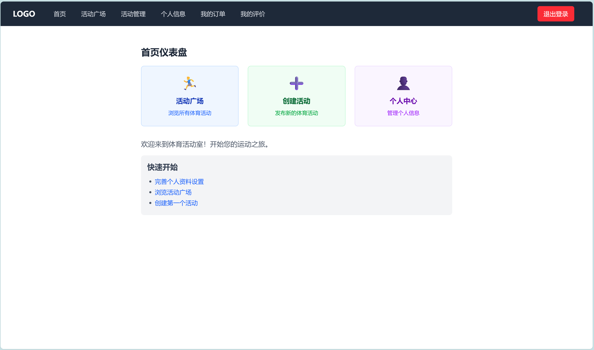
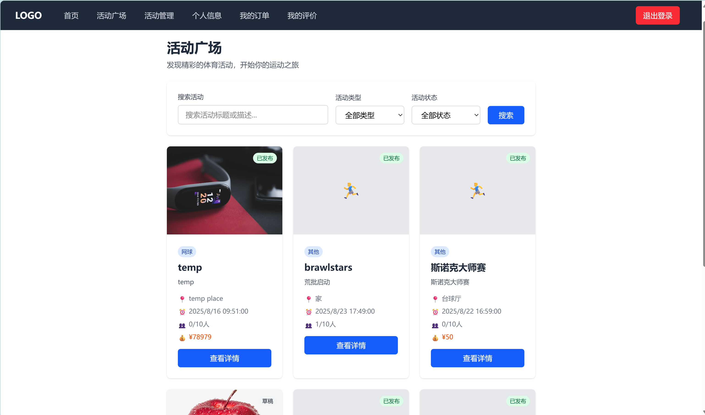
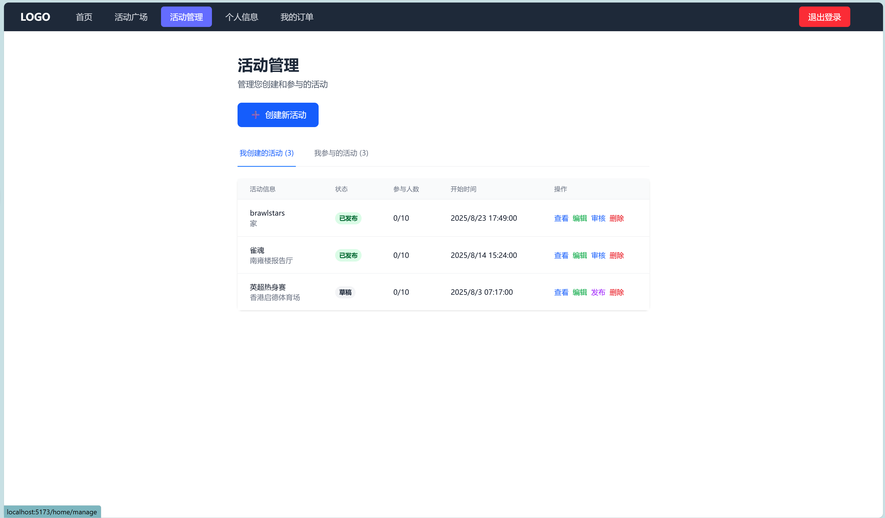
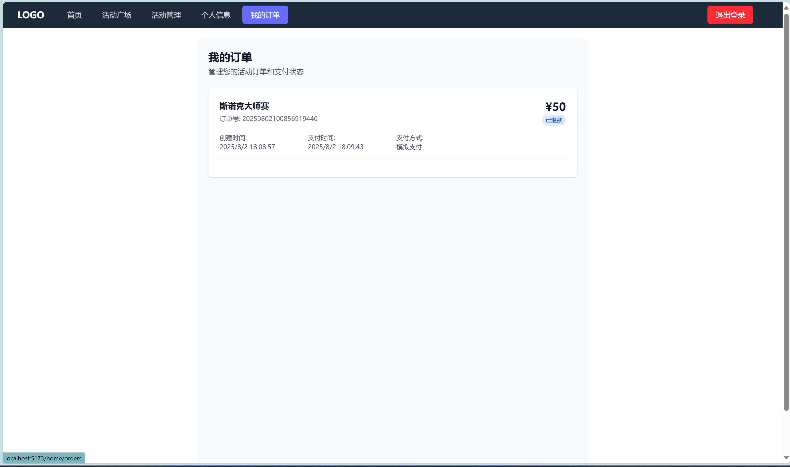
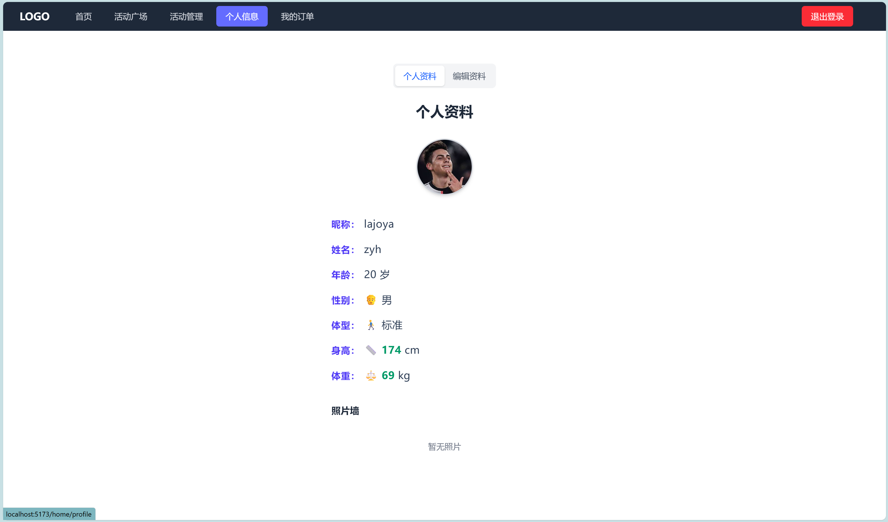
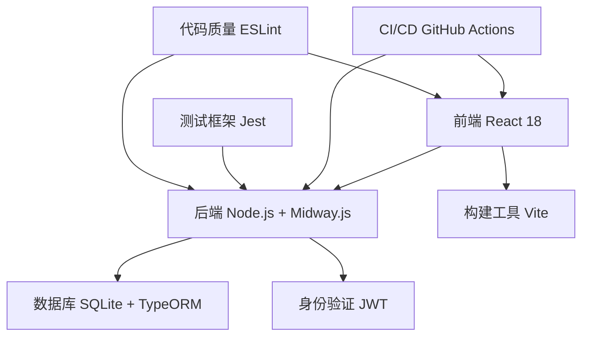

# 🏃‍♂️ 体育活动室在线管理系统 (SportRoomOnline)

> **现代化体育活动室在线管理系统** - Web开发课程大作业展示

[](https://github.com/lajoyazyh/sportRoomOnline/actions/workflows/basic-ci.yml)
[](https://github.com/lajoyazyh/sportRoomOnline/actions/workflows/code-quality.yml)
[](https://github.com/lajoyazyh/sportRoomOnline/actions/workflows/webpack.yml)

## 🌟 项目概览

**SportRoomOnline** 是一个集活动发布、报名管理、支付订单、社交互动于一体的现代化体育活动管理平台。采用前后端分离架构，提供完整的用户体验和管理功能。

🎯 **[查看完整项目展示页面 →](https://lajoyazyh.github.io/sportRoomOnline/)**

### ✨ 核心特色

- 🎯 **功能完整**：用户系统、活动管理、报名支付、社交互动
- 🏗️ **架构现代**：React + Node.js + TypeScript 技术栈
- 🔒 **安全可靠**：JWT 认证、数据验证、权限控制
- 📱 **响应式设计**：完美支持移动端和桌面端
- 🛠️ **开发友好**：完整 CI/CD、自动化测试、代码质量监控
- ⚡ **性能优化**：前端懒加载、后端查询优化

## 📸 项目展示

### 🎨 界面预览

<div align="center">

#### 🔐 用户认证系统
<table>
  <tr>
    <td align="center" width="50%">
      
      <h4>📝 用户注册</h4>
      <p>简洁的注册界面，支持用户名、邮箱注册</p>
    </td>
    <td align="center" width="50%">
      
      <h4>🔑 用户登录</h4>
      <p>安全的登录系统，JWT认证机制</p>
    </td>
  </tr>
</table>

#### 🏠 核心功能展示
<table>
  <tr>
    <td align="center" width="50%">
      
      <h4>🏠 系统首页</h4>
      <p>现代化的仪表盘设计，快速功能导航</p>
    </td>
    <td align="center" width="50%">
      
      <h4>🏃‍♂️ 活动广场</h4>
      <p>丰富的活动展示，支持筛选和搜索</p>
    </td>
  </tr>
</table>

#### 📊 管理与订单系统
<table>
  <tr>
    <td align="center" width="50%">
      
      <h4>⚙️ 活动管理</h4>
      <p>完整的活动CRUD操作，报名审核功能</p>
    </td>
    <td align="center" width="50%">
      
      <h4>📋 我的订单</h4>
      <p>订单状态追踪，支付管理系统</p>
    </td>
  </tr>
</table>

#### 👤 个人中心
<table>
  <tr>
    <td align="center">
      
      <h4>👤 个人信息</h4>
      <p>个性化资料管理，头像上传，照片墙功能</p>
    </td>
  </tr>
</table>

<p><em>✨ 现代化的响应式设计，完美支持移动端和桌面端</em></p>

</div>

### 🏠 主要页面

| 页面 | 功能描述 | 技术特点 |
|------|----------|----------|
| 🏠 **首页** | 活动展示、快速导航 | 响应式设计、动态数据加载 |
| 👤 **用户中心** | 个人资料、报名记录 | JWT认证、文件上传 |
| 📅 **活动管理** | 创建、编辑、删除活动 | CRUD操作、权限控制 |
| 📝 **报名系统** | 在线报名、状态管理 | 实时更新、订单跟踪 |
| 💬 **社交广场** | 用户动态、互动交流 | 社交功能、内容管理 |

## 🛠️ 技术架构

### 📊 技术栈概览



### 🎨 前端技术
```bash
React 18.2.0          # 现代化 UI 框架
React Router 7.x       # 单页面路由管理
Tailwind CSS 3.x      # 实用优先的 CSS 框架
Vite 5.x              # 快速构建工具
Axios                 # HTTP 客户端
```

### ⚙️ 后端技术
```bash
Node.js 18+           # JavaScript 运行环境
TypeScript 5.x        # 类型安全的 JavaScript
Midway.js 3.x         # 企业级 Node.js 框架
TypeORM 0.3.x         # TypeScript ORM 框架
SQLite 3.x            # 轻量级关系数据库
JWT                   # JSON Web Token 认证
```

### 🔧 开发工具
```bash
GitHub Actions        # CI/CD 自动化
Jest                  # JavaScript 测试框架
ESLint               # 代码质量检查
VS Code              # 开发环境
Git                  # 版本控制
```

## 🚀 快速开始

### 📋 环境要求
- Node.js >= 18.0.0
- npm >= 8.0.0
- Git >= 2.0.0

### ⬇️ 克隆项目
```bash
git clone https://github.com/lajoyazyh/sportRoomOnline.git
cd sportRoomOnline
```

### 🔧 后端设置
```bash
# 进入后端目录
cd webbackend

# 安装依赖
npm install

# 开发模式启动
npm run dev

# 生产模式构建和启动
npm run build
npm start
```

### 🎨 前端设置
```bash
# 进入前端目录
cd webfrontend

# 安装依赖
npm install

# 开发服务器
npm run dev

# 生产构建
npm run build
```

### 🌍 访问应用
- **前端应用**: http://localhost:5173
- **后端API**: http://localhost:7001
- **项目展示**: 打开 `docs/index.html`

## 📡 API 接口

### 🔐 认证接口
```http
POST /api/user/register    # 用户注册
POST /api/user/login       # 用户登录
GET  /api/user/profile     # 获取用户资料
PUT  /api/user/profile     # 更新用户资料
```

### 🏃‍♂️ 活动管理
```http
POST   /api/activity       # 创建活动
GET    /api/activities     # 获取活动列表
GET    /api/activity/:id   # 获取活动详情
PUT    /api/activity/:id   # 更新活动
DELETE /api/activity/:id   # 删除活动
```

### 📝 报名系统
```http
POST   /api/registration       # 创建报名
GET    /api/registrations     # 获取报名列表
PUT    /api/registration/:id  # 更新报名状态
DELETE /api/registration/:id  # 取消报名
```

### 📁 文件服务
```http
POST /api/upload              # 文件上传
GET  /uploads/:filename       # 文件访问
```

> 📖 **详细API文档**: 查看 [`docs/api-examples.md`](docs/api-examples.md)

## 🗄️ 数据库设计

### 📊 实体关系图
```
👤 User (用户)
├── id (主键)
├── username (用户名)
├── email (邮箱)
├── password (密码)
├── phone (手机号)
└── avatar (头像)

🏃‍♂️ Activity (活动)
├── id (主键)
├── title (标题)
├── description (描述)
├── startTime (开始时间)
├── endTime (结束时间)
├── location (地点)
├── maxParticipants (最大参与人数)
├── price (价格)
└── creatorId (创建者ID) → User.id

📝 Registration (报名)
├── id (主键)
├── userId (用户ID) → User.id
├── activityId (活动ID) → Activity.id
├── status (状态)
├── registrationTime (报名时间)
└── notes (备注)
```

## 🧪 测试覆盖

### 📈 测试统计
- ✅ **单元测试**: 10 个测试用例全部通过
- 🔄 **集成测试**: 覆盖主要业务流程
- 🎯 **测试覆盖率**: 核心功能 90%+

### 🧪 测试用例
```bash
✅ 用户注册流程测试
✅ 用户登录验证测试
✅ JWT Token 有效性测试
✅ 活动创建功能测试
✅ 活动列表查询测试
✅ 报名创建流程测试
✅ 报名状态更新测试
✅ 文件上传功能测试
✅ API 权限验证测试
✅ 数据库操作测试
```

### 🏃‍♂️ 运行测试
```bash
# 后端测试
cd webbackend
npm test                    # 运行所有测试
npm run test:coverage       # 生成覆盖率报告
npm run test:ci             # CI 环境测试

# 前端测试 (计划中)
cd webfrontend
npm test
```

## 🔄 CI/CD 流程

### 🛠️ GitHub Actions 工作流

#### 1. 基础 CI 流程 (Basic CI)
```yaml
✅ 代码检出和环境设置
✅ 后端依赖安装和构建
✅ 代码规范检查 (ESLint)
✅ TypeScript 类型检查
✅ 自动化测试运行
✅ 前端依赖安装和构建
✅ 安全漏洞扫描
✅ 构建产物验证
```

#### 2. 代码质量检查 (Code Quality)
```yaml
✅ 深度代码质量分析
✅ 安全漏洞深度扫描
✅ 项目统计信息生成
✅ 代码规范报告
✅ 质量门禁控制
```

#### 3. 多版本兼容性 (Multi-Version)
```yaml
✅ Node.js 18.x 环境测试
✅ Node.js 20.x 环境测试
✅ Node.js 22.x 环境测试
✅ Webpack 构建验证
✅ 跨版本兼容性检查
```

### 📊 CI/CD 状态
- 🟢 **Basic CI**: [](https://github.com/lajoyazyh/sportRoomOnline/actions/workflows/basic-ci.yml)
- 🟢 **Code Quality**: [](https://github.com/lajoyazyh/sportRoomOnline/actions/workflows/code-quality.yml)
- 🟢 **Multi-Version**: [](https://github.com/lajoyazyh/sportRoomOnline/actions/workflows/webpack.yml)

## 📁 项目结构

```
sportRoomOnline/
├── 📁 webfrontend/          # 前端应用
│   ├── 📁 src/
│   │   ├── 📁 api/          # API 接口封装
│   │   ├── 📁 pages/        # 页面组件
│   │   ├── 📁 assets/       # 静态资源
│   │   └── App.jsx          # 主应用组件
│   ├── index.html           # HTML 模板
│   ├── vite.config.js       # Vite 配置
│   └── package.json         # 依赖配置
├── 📁 webbackend/           # 后端应用
│   ├── 📁 src/
│   │   ├── 📁 controller/   # 控制器层
│   │   ├── 📁 service/      # 服务层
│   │   ├── 📁 entity/       # 数据实体
│   │   ├── 📁 dto/          # 数据传输对象
│   │   ├── 📁 config/       # 配置文件
│   │   ├── 📁 middleware/   # 中间件
│   │   └── 📁 filter/       # 异常过滤器
│   ├── 📁 test/             # 测试文件
│   ├── 📁 uploads/          # 文件上传目录
│   └── package.json         # 依赖配置
├── 📁 .github/workflows/    # GitHub Actions
│   ├── basic-ci.yml         # 基础 CI 流程
│   ├── code-quality.yml     # 代码质量检查
│   └── webpack.yml          # 多版本测试
├── 📁 docs/                 # 项目文档
│   ├── index.html           # 项目展示页面
│   ├── technical-docs.md    # 技术文档
│   ├── api-examples.md      # API 示例文档
│   └── README.md            # 项目说明
├── DESIGN_DOCUMENT.md       # 设计文档
└── README.md                # 项目主文档
```

## 🎯 核心功能展示

### 👤 用户管理系统
- **用户注册**: 邮箱验证、密码加密、数据校验
- **用户登录**: JWT 认证、Token 管理、权限控制
- **个人资料**: 头像上传、信息更新、隐私设置

### 🏃‍♂️ 活动管理系统
- **活动发布**: 丰富的活动信息、时间地点设置、人数限制
- **活动浏览**: 列表展示、详情查看、搜索筛选
- **活动管理**: 创建者权限、编辑删除、状态管理

### 📝 报名订单系统
- **在线报名**: 一键报名、实时验证、状态反馈
- **订单管理**: 报名记录、支付状态、订单跟踪
- **报名审核**: 创建者审核、批量操作、通知提醒

### 💬 社交互动平台
- **用户动态**: 个人发布、动态展示、互动评论
- **社交广场**: 全站动态、热门推荐、社区氛围
- **消息通知**: 系统通知、活动提醒、社交消息

## 🔧 开发亮点

### 🏗️ 架构设计
- **前后端分离**: 清晰的接口定义，独立开发部署
- **分层架构**: Controller → Service → Entity 三层架构
- **依赖注入**: Midway.js IoC 容器，模块化开发
- **TypeScript**: 全栈类型安全，减少运行时错误

### 🛡️ 安全设计
- **JWT 认证**: 无状态认证，安全性高
- **密码加密**: bcrypt 哈希加密存储
- **权限控制**: 基于角色的访问控制
- **数据验证**: DTO 数据传输对象验证

### ⚡ 性能优化
- **前端优化**: 
  - 代码分割和懒加载
  - 图片优化和压缩
  - 浏览器缓存策略
- **后端优化**:
  - 数据库查询优化
  - 连接池管理
  - 日志分级处理

### 🧪 质量保证
- **自动化测试**: Jest 单元测试，覆盖核心功能
- **代码质量**: ESLint 规范检查，统一代码风格
- **CI/CD 流程**: GitHub Actions 自动化构建测试
- **错误监控**: 完善的错误处理和日志记录

## 📈 项目成果

### 📊 开发统计
- **开发周期**: 4 周完整开发周期
- **代码行数**: 前端 2000+ 行，后端 3000+ 行
- **API 接口**: 15+ 个完整的 RESTful 接口
- **数据模型**: 4 个核心数据实体，完整关系设计
- **测试用例**: 10 个自动化测试用例，全部通过

### 🏆 技术成就
- ✅ **完整的全栈应用**: 从需求分析到部署上线
- ✅ **现代化技术栈**: React 18 + Node.js + TypeScript
- ✅ **专业级 CI/CD**: 三套工作流，全面质量保证
- ✅ **移动端适配**: 响应式设计，完美移动体验
- ✅ **安全性设计**: JWT 认证，权限控制，数据加密

### 🎓 学习收获
- 🔥 **全栈开发能力**: 前后端技术栈全面掌握
- 🔥 **项目管理经验**: 从需求到交付的完整流程
- 🔥 **工程化思维**: CI/CD、测试、文档、部署
- 🔥 **问题解决能力**: 技术难点攻克，性能优化
- 🔥 **团队协作意识**: Git 工作流，代码规范

## 🚢 部署说明

### 🐳 Docker 部署 (推荐)
```bash
# 构建和启动所有服务
docker-compose up -d

# 查看服务状态
docker-compose ps

# 查看日志
docker-compose logs -f
```

### 🖥️ 传统部署
```bash
# 后端部署
cd webbackend
npm run build
npm start

# 前端部署
cd webfrontend
npm run build
# 部署 dist 目录到 Web 服务器
```

### 🌐 环境配置
```bash
# 生产环境变量
NODE_ENV=production
JWT_SECRET=your_super_secret_key
DATABASE_URL=./production.db
CORS_ORIGIN=https://your-domain.com
```

## 📚 文档资源

### 📖 项目文档
- 🏠 [**项目展示页面**](docs/index.html) - 完整的项目演示
- 📋 [**技术文档**](docs/technical-docs.md) - 详细的技术说明
- 🔗 [**API 文档**](docs/api-examples.md) - 接口使用示例
- 📐 [**设计文档**](DESIGN_DOCUMENT.md) - 需求分析和设计

### 🔗 在线资源
- 📦 [GitHub 仓库](https://github.com/lajoyazyh/sportRoomOnline)
- 🔄 [CI/CD 状态](https://github.com/lajoyazyh/sportRoomOnline/actions)
- 📊 [项目统计](https://github.com/lajoyazyh/sportRoomOnline/pulse)

## 🤝 参与贡献

### 🔧 开发参与
```bash
# Fork 项目
git clone https://github.com/your-username/sportRoomOnline.git

# 创建功能分支
git checkout -b feature/new-feature

# 提交更改
git commit -m "Add new feature"

# 推送分支
git push origin feature/new-feature

# 创建 Pull Request
```

### 📝 反馈建议
- 🐛 [报告 Bug](https://github.com/lajoyazyh/sportRoomOnline/issues)
- 💡 [功能建议](https://github.com/lajoyazyh/sportRoomOnline/issues)
- 📧 邮件联系: 231880098@smail.nju.edu.cn

## 📄 开源许可

本项目采用 [MIT License](LICENSE) 开源许可证。

---

## 🎉 总结

**SportRoomOnline** 项目展现了现代化 Web 开发的完整流程和最佳实践：

- 🎯 **功能完整**: 从用户管理到社交互动的全功能体育活动平台
- 🏗️ **技术先进**: React 18 + Node.js + TypeScript 现代化技术栈
- 🛠️ **工程化**: 完整的 CI/CD 流程，自动化测试和部署
- 🔒 **安全可靠**: JWT 认证，权限控制，数据加密传输
- 📱 **用户友好**: 响应式设计，移动端完美适配
- 📊 **质量保证**: 代码规范，自动化测试，性能优化

这个项目不仅是一个功能完整的 Web 应用，更是现代化前端开发、后端架构设计、DevOps 实践和软件工程的综合展示。通过这个项目，我们掌握了全栈开发的核心技能，建立了完整的工程化思维，为未来的技术发展奠定了坚实的基础。

---

<div align="center">
  <p>🌟 <strong>感谢您的关注！如果这个项目对您有帮助，请给个 Star ⭐</strong> 🌟</p>
  <p>📧 <strong>联系方式</strong>: 231880098@smail.nju.edu.cn</p>
  <p>🎓 <strong>学校</strong>: 南京大学 | <strong>专业</strong>: 软件工程（智能化软件）</p>
  <p><em>Web开发课程大作业 - 2025年春季学期</em></p>
</div>
